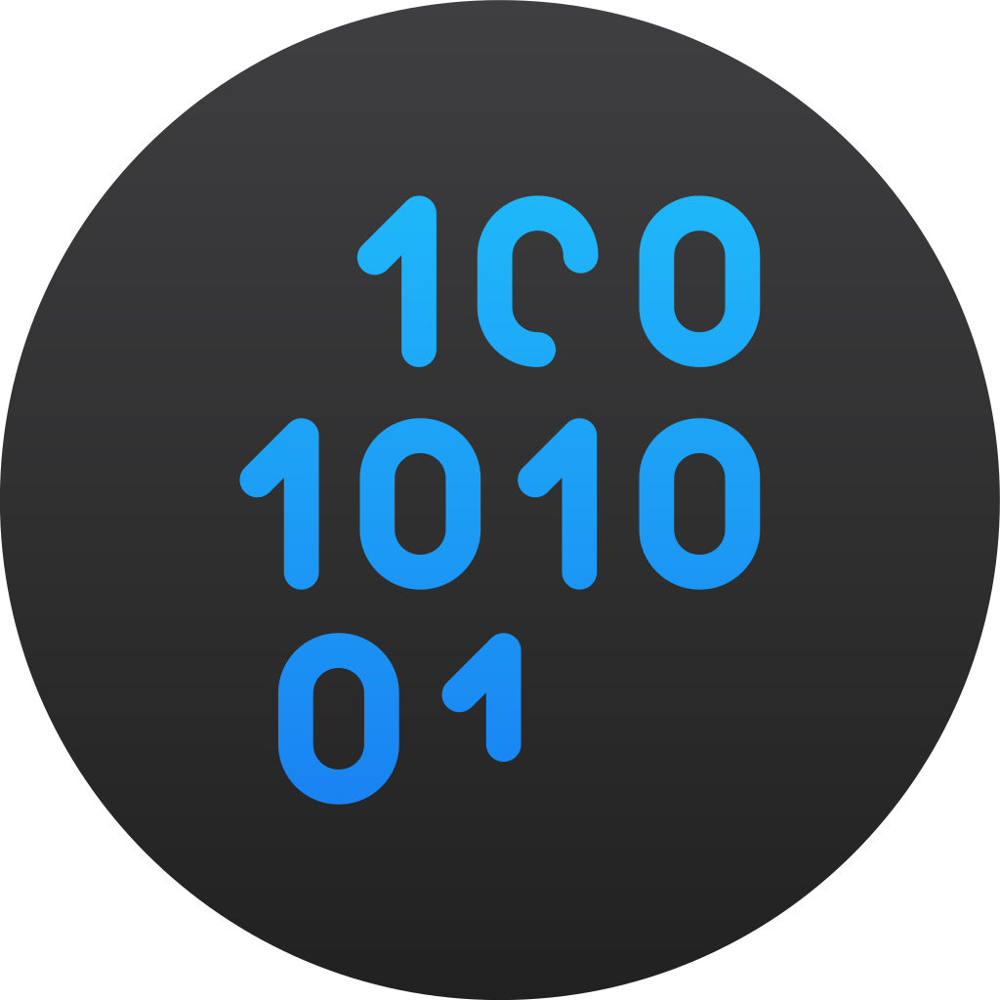
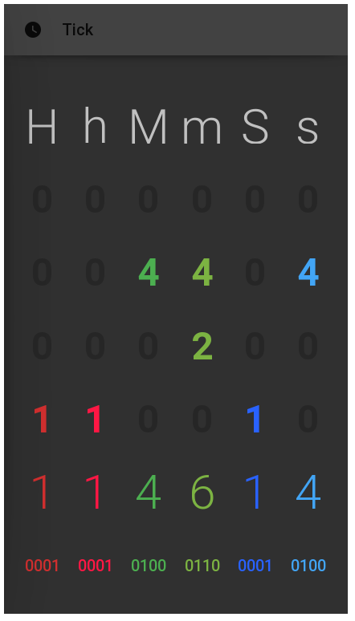
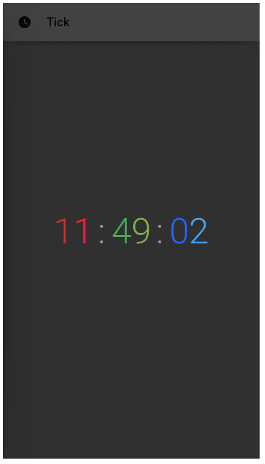
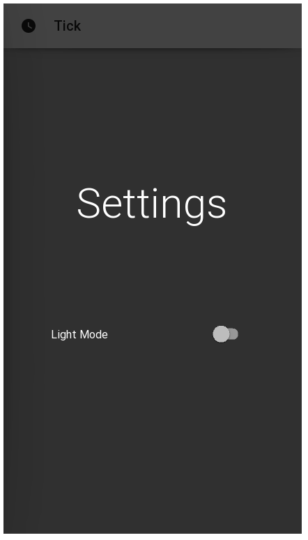
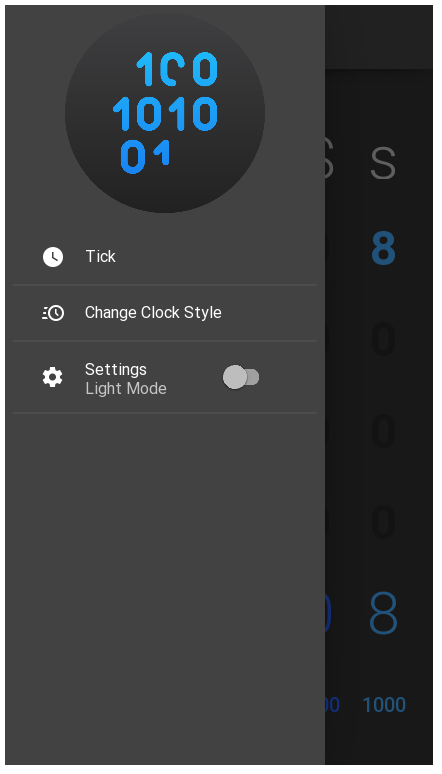
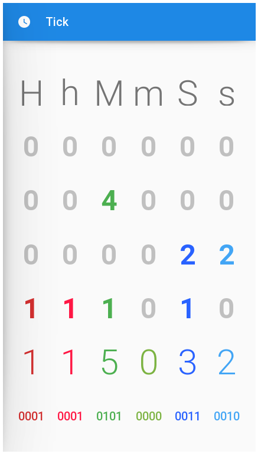
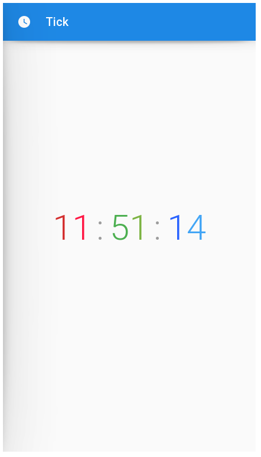
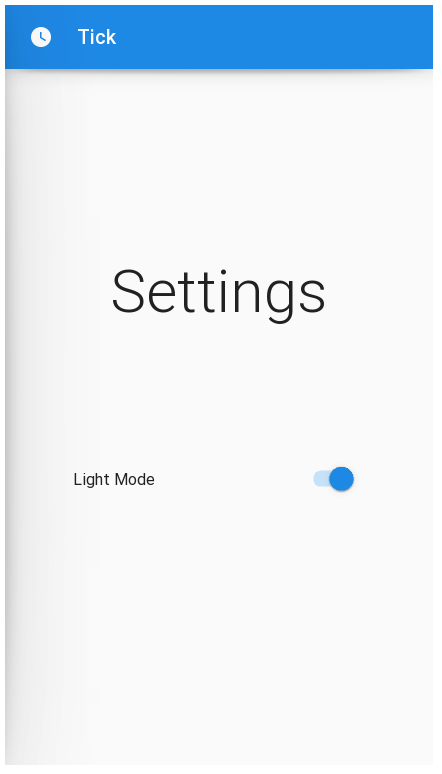
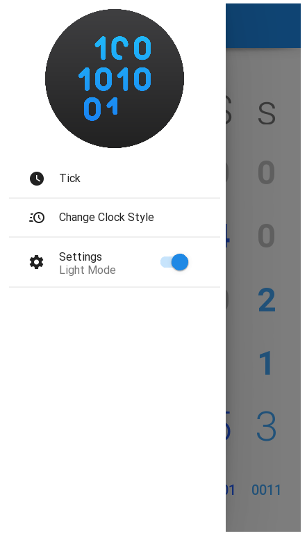

#  Kivy Binary Clock App
This is a cross-platform binary clock app developed completely in python3 along with the kivy framework and kivymd widgets.

* The app is fully scalable and therfore can be used on multiple devices.
* The app also has a light theme other than this dark theme.
* The app also supports landscape orientation.

## Demo

## Screenshots

## Requirements

* Kivy > 2.0.0rc1 `pip3 install kivy==2.0.0rc1`
* KivyMD > 0.104.0 `pip3 install kivymd==0.104.0`

# Usage

APK File: `/bin/bclock-1.0-armeabi-v7a-debug.apk`

Python Code File: `main.py`

Kivy Lang Layout File: `clock.kv`
